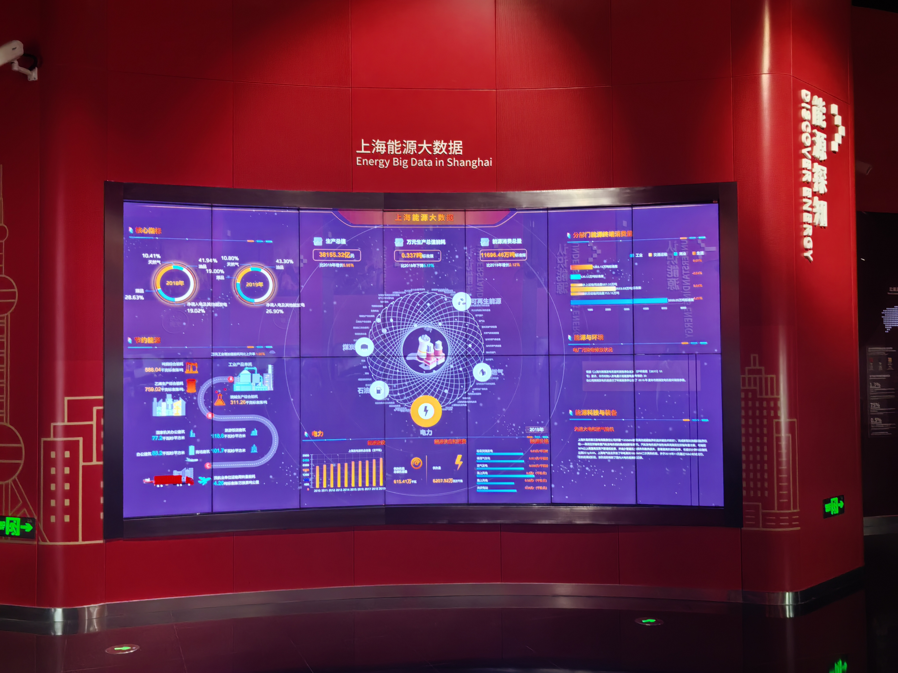
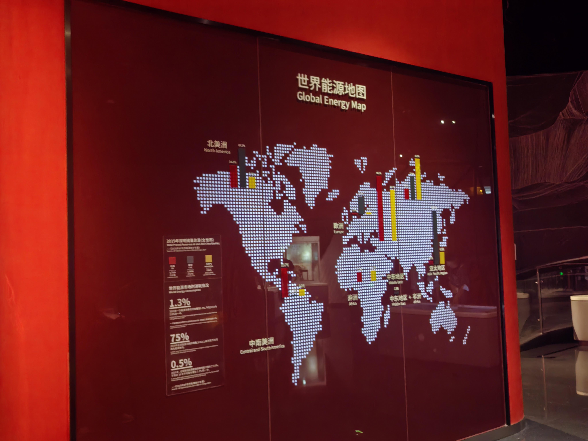

# Appendix A. Technical Evidence, Continuity, Governance, and Evaluation

## A1. Week 1–2 Integration Record

This project changes domain while preserving several methodological lessons from my earlier INFOSCI 301 work. “Retained” means the principle continues to shape the current redesign; “revised” means it is adapted to a different research question; “rejected” means the earlier domain or mechanism is documented but not forced into the present artifact.

| Earlier component                                                                                     | Decision                     | Transfer to this project                                                                                                                                       |
| ----------------------------------------------------------------------------------------------------- | ---------------------------- | -------------------------------------------------------------------------------------------------------------------------------------------------------------- |
| 2056 aspiration: help people question opaque recommendations rather than simply accept system outputs | Retain + revise              | Extend transparency from recommendation ranking to prompt revision and AI interpretation.                                                                      |
| Week 1 Zhouzhuang recommendation domain                                                               | Replace domain               | The current project does not claim a Zhouzhuang need for prompt-history inspection.                                                                            |
| Week 1 popularity/default transparency                                                                | Retain principle             | Make system-produced interpretation inspectable rather than presenting it as neutral fact.                                                                     |
| Week 1 evidence safeguard                                                                             | Strongly retain              | Separate documented source records from illustrative, generated, derived, or designer-produced information.                                                    |
| Week 1 prototype                                                                                      | Retain methodological lesson | The Zhouzhuang travel-recommendation prototype made ranking logic inspectable by allowing users to reduce popularity influence and compare resulting rankings. |
| Week 1 visual-argument lesson                                                                         | Retain                       | Rankings, prompt diffs, and AI summaries are shaped by selected data, transformations, and encodings rather than being neutral representations.                |
| Week 2 Energy Lens domain                                                                             | Replace domain               | Energy records do not answer the current prompt-revision research question.                                                                                    |
| Week 2 field-trip lesson: different questions require different visual forms                          | Retain                       | Preserve the graph for revision history while adding the Influence Inspector for focused evidence comparison.                                                  |
| Week 2 Total versus Per Capita lesson                                                                 | Retain governance principle  | Just as derived per-capita values required explicit labeling, derived word diffs and AI summaries remain distinguishable from source records.                  |
| Week 2 provenance, missingness, and prohibited inference                                              | Strongly retain              | Show unavailable historical images, regenerated-image status, provenance classes, and claim limits directly in the interface.                                  |
| Human design decisions                                                                                | Retain                       | Record graph retention, non-ranking of upscale, and evidence/interpretation separation as explicit design decisions.                                           |

### A1.1 Week 1 artifact

**Transparent Zhouzhuang Travel Recommendation Prototype**
Interactive site: https://travel-recommendations.my.canva.site/

The Week 1 prototype explored recommendation ranking as an inspectable visual argument rather than a neutral list. It used fields documented in the IntTravel dataset schema, including popularity, geographic information, category, coordinates, and travel mode. Users could reduce the influence assigned to popularity and inspect how the resulting ranking changed.

The prototype deliberately separated documented dataset fields from illustrative values and designer-assigned weights. This distinction directly informed the current project’s separation of recorded prompt data, derived word differences, regenerated images, and AI interpretation.

### A1.2 Week 2 artifact

**Energy Lens v2**
Public Space: https://huggingface.co/spaces/dku-infosci301-Autumn2026/Sitong-W2

Energy Lens reorganized public energy visualization around several distinct questions—Place, Magnitude, Mix, and Change—rather than attempting to communicate every indicator through one visualization. The project also made provenance, calculation, missingness, and prohibited inference visible in the interface.

The current Prompt Influence Inspector carries forward two main lessons from Energy Lens:

1. different analytical questions may require different coordinated visual idioms; and
2. derived or transformed information should remain visibly distinct from source data.

---

## A2. Field Evidence, Precedents, Community, and SDG

### A2.1 Field-photo evidence

Two photographs taken during the INFOSCI 301 field trip at the Shanghai Science and Technology Museum on September 4, 2026 informed the earlier Energy Lens project and continue to provide a methodological precedent for the current redesign.

#### Photo 1 — Energy Big Data in Shanghai

**Location:** Shanghai Science and Technology Museum, Shanghai
**Date:** September 4, 2026

The display combines many indicators and several visual forms in one coordinated dashboard. It simultaneously presents energy composition, production-related quantities, relationships, categories, and comparisons.

I do not infer that visitors were confused or that the exhibit was unsuccessful. The narrower design lesson is that a dense overview can support system-level inspection, while a focused analytical question may benefit from a separate detail view. This contributes to the current graph-plus-inspector structure.

#### Photo 2 — Global Energy Map

**Location:** Shanghai Science and Technology Museum, Shanghai
**Date:** September 4, 2026

Unlike the dense dashboard, this display foregrounds geographic location and regional comparison through a single dominant spatial representation.

The contrast suggests that visual idioms foreground different questions. This informed the decision to retain the Image Variant Graph for revision history while using the Influence Inspector for a narrower provenance and comparison task.

These photographs are treated as evidence of the visual forms I directly observed, not as evidence about visitor comprehension, institutional effectiveness, or user preference.

### A2.2 Open-source and research precedents

| Precedent                                     | Source                                            | Useful idea                                                                                                            | Limitation for this project                                                                                                                                                                                                                |
| --------------------------------------------- | ------------------------------------------------- | ---------------------------------------------------------------------------------------------------------------------- | ------------------------------------------------------------------------------------------------------------------------------------------------------------------------------------------------------------------------------------------ |
| PrompTHis                                     | Guo et al.; Vis4Sense/PrompTHis repository        | Represents prompt-image revision history as a graph and supports comparison across generated variants.                 | The current project does not reproduce the full PrompTHis implementation or its influence computation. The new redesign also requires explicit separation of missing historical images, regenerated demonstrations, and AI interpretation. |
| Mid-Journey-to-alignment / Midjourney Threads | Don-Yehiya, Choshen, and Abend dataset repository | Provides real sequential prompt-edit records, timestamps, generation arguments, thread structure, and upscale actions. | Historical image URLs in the selected thread are unavailable, and the dataset does not provide creator intention or explicit preference judgments.                                                                                         |
| Diffusion Explainer                           | Lee et al., IEEE VIS 2024                         | Connects research explanation, interactive inspection, and open-source implementation in a public-facing artifact.     | Its explanatory goal and diffusion-model focus differ from this project’s prompt-revision and provenance task.                                                                                                                             |

PrompTHis provides the main visualization precedent. Midjourney Threads provides complementary interaction data. Diffusion Explainer serves as an example of linking research, an interactive artifact, and inspectable technical evidence.

### A2.3 Community hypothesis and missing voices

**Prospective community:** DKU students and novice digital creators who use generative AI for coursework, design, or creative experimentation.

The initial need was treated as a hypothesis rather than an established community claim. A formative evaluation with four DKU student proxies later provided preliminary evidence that provenance distinction was difficult in the Baseline interface: none of the four fully distinguished source, regenerated, and interpreted material. All four correctly distinguished these layers in the Redesign condition.

This does not establish the needs of a broader creator community.

Missing voices include:

* art and design students;
* professional creators;
* instructors;
* people who avoid generative AI;
* users with limited experience reading provenance labels;
* and the anonymous creator represented in the selected Midjourney thread.

Future dialogue should examine whether the provenance terminology is understandable, what evidence creators need when reviewing revision history, and what forms of creative-history reuse they consider acceptable.

### A2.4 SDG mechanism

| Element            | Scoped statement                                                                                         |
| ------------------ | -------------------------------------------------------------------------------------------------------- |
| Target             | UN SDG 4.4: relevant technical, vocational, and ICT skills                                               |
| Technology         | Prompt-conditioned image generation and multimodal comparison                                            |
| Visual mechanism   | Persistent provenance legend plus separated evidence/interpretation blocks                               |
| Possible use       | Practice inspecting AI-supported creative records                                                        |
| Observable outcome | Correctly classify displayed material by provenance and avoid equating upscale with objective preference |
| Claim boundary     | The prototype may support an AI-literacy mechanism; it does not achieve SDG 4.4 by itself                |

---

## A3. Data Contract and Governance Record

### A3.1 Three data conditions

| Condition                 | Artifact and coverage                                                                                | Governance response                                                                                                   |
| ------------------------- | ---------------------------------------------------------------------------------------------------- | --------------------------------------------------------------------------------------------------------------------- |
| Current/baseline data     | Attributed reconstruction of the PrompTHis Image Variant Graph; no original PrompTHis session export | State reconstruction status and do not claim full replication.                                                        |
| Complementary public data | Midjourney Threads, `data/threads_0.csv`, thread `2231`, three consecutive records                   | Preserve exact identifiers, prompts, timestamps, parameters, and upscale labels.                                      |
| No suitable open data     | Creator intention and explicit preference for each edit; historical image URLs inaccessible          | Do not infer intention or preference; display original-image failure; use clearly labeled regenerated demonstrations. |

### A3.2 Selected source records

| Step | Record ID             | UTC timestamp           | Parameters    | Upscaled |
| ---- | --------------------- | ----------------------- | ------------- | -------- |
| 1    | `1071138984736084058` | 2023-02-03 18:43:54.761 | `--chaos 50`  | False    |
| 2    | `1071139569849880656` | 2023-02-03 18:46:14.263 | `--quality 5` | True     |
| 3    | `1071140082511253515` | 2023-02-03 18:48:16.491 | `--quality 5` | True     |

Selection rule: three consecutive English-language records were selected because they contain two compact, inspectable revisions.

The selected revisions include:

* Step 1 → Step 2: add “HD” and remove “surreal”;
* Step 2 → Step 3: add “forrest” and remove “front view.”

The misspelling “forrest” is preserved because it is part of the recorded source prompt.

The sample supports an interface demonstration and formative task, not statistical claims.

### A3.3 Provenance classes and transformations

| Class             | Fields shown                                                        | Processing                                                                                               |
| ----------------- | ------------------------------------------------------------------- | -------------------------------------------------------------------------------------------------------- |
| Recorded source   | prompt, arguments, record ID, timestamp, thread ID, upscale Boolean | Copied from selected CSV rows and checked against the source file                                        |
| Derived           | added/removed terms                                                 | Deterministic word-level comparison; source spelling preserved                                           |
| Regenerated       | three locally stored images                                         | Independently generated from the recorded prompts with shared framing constraints and manually inspected |
| AI interpretation | visual tags and summaries                                           | Pre-generated, manually compared with the displayed images, and stored locally                           |
| Missing           | three historical images, creator intention, explicit preference     | Historical image URLs recorded as unavailable; other fields marked unavailable rather than inferred      |

### A3.4 Evidence substitution and claim boundaries

The central governance risk is evidence substitution.

The historical Discord CDN URLs associated with all three selected records returned HTTP 404 on September 13, 2026. Newly generated images are therefore not presented as historical Midjourney outputs.

The interface explicitly distinguishes:

* what was recorded in the dataset;
* what was derived deterministically;
* what was regenerated for demonstration;
* what was interpreted by AI;
* and what remains unavailable.

Independent regeneration introduces uncontrolled variation. A visual change that appears after a prompt edit cannot therefore be treated as proof that the edited word caused that change.

Similarly, the upscale Boolean is treated only as a historical behavioral trace. It does not establish:

* explicit preference;
* objective quality;
* creator satisfaction;
* or the reason the action was taken.

### A3.5 FAIR, Datasheets, reuse, and CARE

* **Findable:** the paper, dataset repository, source file, thread ID, and record IDs are documented.
* **Accessible:** the public CSV and local JSON can be inspected without an API; historical CDN images are no longer accessible.
* **Interoperable:** selected source fields are mapped into a small documented JSON structure.
* **Reusable:** source and transformation notes support checking, but broader reuse should respect the conditions of the original repositories.
* **Datasheets:** motivation, composition, collection context, transformations, intended task, limitations, and missing data are documented.
* **CARE relevance:** no Indigenous community or authority is identified in the selected sample, so the project does not make an Indigenous-data-governance claim.

Personal identifiers are not displayed. Anonymous user and Discord-channel identifiers that are unnecessary for the task are excluded from the interface.

---

## A4. Technical Evidence and Reproduction

| Item                    | Evidence                                                        |
| ----------------------- | --------------------------------------------------------------- |
| Repository              | https://github.com/dku-infosci301-Autumn2026/infovis-sc972      |
| Live demo               | https://infovis-sc972.vercel.app/                               |
| Entry file              | `index.html`                                                    |
| Styles                  | `style.css`                                                     |
| Interaction logic       | `script.js`                                                     |
| Data file               | `data/prototype.json`                                           |
| Image-generation record | `docs/image-generation-record.md`                               |
| Evaluation record       | `docs/evaluation-record.md`                                     |
| Main paper draft        | `docs/paper-main-condensed.md`                                  |
| Appendix B              | `docs/appendix-b.md`                                            |
| Figure 1                | `assets/screenshots/figure1-prompthis-original.png`             |
| Figure 2                | `assets/screenshots/figure2-baseline-vs-redesign.png`           |
| Field photo 1           | `assets/field/energy-big-data-shanghai.jpg`                     |
| Field photo 2           | `assets/field/global-energy-map.jpg`                            |
| Local run               | `python -m http.server 8000`, then open `http://localhost:8000` |
| Runtime dependencies    | No build step, package manager, API key, or backend             |

### A4.1 Working interaction

The deployed artifact supports the following sequence:

1. Load the three selected Midjourney Threads records.
2. Switch between **Baseline** and **Redesign**.
3. Select either edit edge in the Image Variant Graph.
4. Inspect the exact before/after prompts.
5. Compare regenerated images.
6. In Redesign, inspect the historical action, provenance status, claim limits, and AI-generated visual summary.
7. Read the unavailable-source warning before drawing conclusions.

### A4.2 Accessibility and interface checks

The prototype includes:

* keyboard-focusable controls;
* `aria-pressed` state for mode switching;
* alt text for displayed images;
* readable provenance labels;
* explicit loading and failure states;
* no dependence on inaccessible local file paths;
* and no runtime AI service requirement.

### A4.3 Deployment and failure checks

Checks completed during development included:

* Vercel page and static assets loading correctly;
* CSS and JavaScript loading without a build process;
* JSON parsing successfully;
* graph-edge selection updating the comparison;
* Baseline/Redesign visibility behavior working;
* historical Discord image URLs returning HTTP 404;
* local generated images remaining available when external services are unavailable.

### A4.4 Failure handling

* Data-fetch failure produces an explicit error message and local-server instruction.
* Historical-image failure remains visible next to the regenerated comparison.
* Creator intention and explicit preference are marked unavailable.
* No live AI dependency exists; stored summaries remain inspectable without external model access.

### A4.5 GitHub evidence trail

The repository documents development through multiple commits on September 13, 2026.

Representative milestones include:

| Commit                     | Recorded message                              | Interpreted milestone                                            |
| -------------------------- | --------------------------------------------- | ---------------------------------------------------------------- |
| `26b9fa1`                  | `feat: add evidence-aware redesign prototype` | Initial working evidence-aware prototype                         |
| `9e18a71`                  | `Add files via upload`                        | Repository file upload                                           |
| `9d3c40e`                  | `Add files via upload`                        | Midjourney example and generated assets                          |
| later September 13 commits | documentation and interface updates           | Documentation, screenshots, provenance, and evaluation revisions |

Because several commits use generic upload messages, milestone interpretation relies on file history rather than commit-message wording alone.

---

## A5. Evaluation Materials and Revision Record

The complete evaluation protocol and anonymized participant records are stored in `docs/evaluation-record.md`.

Four DKU student proxies completed one Baseline task and one Redesign task using a counterbalanced order:

* P1 and P3: Baseline → Redesign
* P2 and P4: Redesign → Baseline

The evaluation recorded:

* prompt-edit identification;
* explanation of visible image changes;
* completion time;
* provenance classification;
* interpretation of the historical upscale label;
* confidence on a 1–5 scale;
* participant comments and suggested interface changes.

The study was formative rather than a controlled experiment. Participants did not always inspect the same edit pair across both interface conditions, so aggregate values are treated as descriptive evidence rather than causal estimates.

### A5.1 Aggregate results

| Measure                                  | Baseline | Redesign |
| ---------------------------------------- | -------: | -------: |
| Fully correct prompt-edit identification |      2/4 |      4/4 |
| Fully correct provenance distinction     |      0/4 |      4/4 |
| Median completion time                   |   87.5 s |   66.5 s |
| Median confidence                        |    3.5/5 |    4.5/5 |
| Correct upscale interpretation           |        — |      4/4 |

### A5.2 Prompt-edit identification

In Baseline:

* P1 correctly noticed the addition of “HD” but initially overlooked the removal of “surreal.”
* P3 noticed “forrest” but initially missed the removal of “front view.”
* P2 and P4 identified the full edit.

In Redesign, all four participants identified the complete prompt edit.

This suggests that the explicit word-level diff may help users notice removed terms that are easier to overlook when comparing full prompts.

### A5.3 Provenance comprehension

Provenance misunderstanding was more common in Baseline.

* P1 initially assumed that the regenerated images were the original dataset images.
* P3 initially assumed that all visible content came directly from the selected dataset.
* P2 completed the comparison but said the relationship between the dataset and images was unclear.
* P4 understood that the interface was reconstructed but wanted regenerated-image status closer to the thumbnails.

In Redesign, all four participants correctly distinguished recorded source information from regenerated demonstrations and AI interpretation.

This was the clearest pattern in the small formative evaluation.

### A5.4 Upscale interpretation

All four participants correctly rejected the claim that upscale represented an objective preference or image-quality score.

Participant descriptions included:

* “a useful behavioral signal, but not a direct rating”;
* “an action, not a clear statement saying ‘I prefer this’”;
* and evidence that the user “did something with that result.”

These responses support the decision to keep upscale as contextual text rather than encoding it as rank, quality, or node importance.

### A5.5 Generation variability

Participants repeatedly noticed image differences that could not safely be attributed to one prompt edit.

Examples included:

* feather position;
* composition changes;
* camera angle;
* layout differences;
* and broader scene changes.

This supports keeping the generation-variability warning visible and avoiding causal wording such as:

> “This word caused this image change.”

A safer claim is that a recorded revision corresponds with visible differences in the regenerated comparison.

### A5.6 Participant-derived revision directions

Evaluation feedback motivated four concrete refinements:

1. Make the **“regenerated demonstration”** label more visually prominent.
2. Move provenance information closer to image thumbnails.
3. Shorten some explanatory paragraphs into more scannable text.
4. Keep the provenance legend and generation-variability warning persistently visible.

These participant-derived suggestions are distinguished from earlier designer-led walkthrough revisions.

### A5.7 Evaluation limitations

The evaluation does not establish general interface effectiveness.

Limitations include:

* only four DKU student proxies;
* no professional or art/design participants;
* prompt-edit pairs were not perfectly matched across all conditions;
* a short evaluation session;
* regenerated images contain uncontrolled visual variability;
* and the selected dataset sample contains only one three-step thread.

The results therefore support iterative design decisions rather than population-level conclusions.

---

## A6. Human Decisions, Accepted and Rejected Directions, and Credits

### A6.1 Human design decisions

Three decisions were especially important.

#### 1. Retain the graph

The original history-oriented graph was retained rather than replaced with isolated comparison cards.

Reason: the graph still communicates sequence and provenance relationships. The Influence Inspector answers a narrower comparison question without discarding the historical structure.

#### 2. Do not rank upscale

The historical upscale Boolean is shown as contextual information rather than being encoded through:

* node size;
* ranking;
* score;
* recommendation;
* or “quality.”

Reason: the action does not reveal why it occurred.

#### 3. Separate evidence from interpretation

Recorded source data, regenerated material, AI interpretation, and missing evidence receive different labels and visual treatment.

Reason: combining them into a single seamless explanation would obscure their different evidentiary status.

### A6.2 Accepted and rejected directions

| Direction                                       | Decision                                          | Reason                                                                                                              |
| ----------------------------------------------- | ------------------------------------------------- | ------------------------------------------------------------------------------------------------------------------- |
| Pick-a-Pic preference data on prompt-edit edges | Rejected                                          | Pick-a-Pic compares images generated from the same prompt; its preference label does not measure a prompt revision. |
| Midjourney Threads iterative records            | Accepted                                          | Consecutive prompts fit the edge-based revision task.                                                               |
| Live multimodal API                             | Rejected for this artifact                        | Adds API keys, backend dependency, latency, and non-repeatable runtime output.                                      |
| Stored regenerated images                       | Accepted with explicit labels                     | Enables a static, inspectable comparison while preserving provenance boundaries.                                    |
| Stored AI-generated summaries                   | Accepted with explicit labels and manual checking | Supports the experimental inspector without implying source authority.                                              |
| Claim that PrompTHis lacks influence analysis   | Rejected                                          | The original system already supports prompt-image comparison and influence analysis.                                |
| Infer creator intention                         | Rejected                                          | Intention is not recorded in the selected data.                                                                     |
| Treat upscale as preference                     | Rejected                                          | Upscale is an observed historical action, not an explicit preference judgment.                                      |
| Hide inaccessible original images               | Rejected                                          | Missingness is itself relevant evidence and should remain visible.                                                  |

### A6.3 AI assistance and human verification

AI assistance was used to:

* scaffold and revise code;
* generate three demonstration images;
* draft visual-change summaries;
* help organize documentation;
* and support wording and structural revisions.

Human verification included:

* checking selected CSV records against the dataset;
* preserving source prompt spelling;
* checking generated images against their prompts;
* manually comparing AI summaries with the displayed images;
* checking the live interaction;
* verifying historical-image failure;
* reviewing provenance labels;
* and making final design and claim-boundary decisions.

Further detail appears in Appendix B.

### A6.4 Credits

* **Project design, implementation decisions, verification, evaluation, and responsibility:** Sitong Chang
* **Selected visualization system:** Guo et al., *PrompTHis*
* **Complementary dataset:** Don-Yehiya, Choshen, and Abend, *Midjourney Threads / Mid-Journey-to-alignment*
* **Field observations:** photographs taken at the Shanghai Science and Technology Museum on September 4, 2026
* **Week 1 continuity:** Transparent Zhouzhuang Travel Recommendation Prototype
* **Week 2 continuity:** Energy Lens v2
* **AI assistance:** documented in Appendix B

No unverified teammate quotation is included because an exact attributable peer statement was not preserved in the available record.
