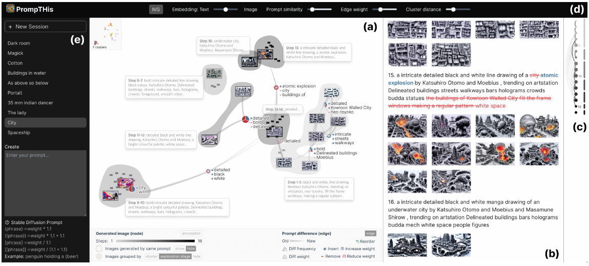

# Prompt Influence Inspector: Separating Recorded Evidence from AI Interpretation

Sitong Chang · INFOSCI 301 · Condensed two-page draft

## Abstract

Text-to-image creation often requires iterative prompt editing, yet visible output differences do not reveal which evidence is historical, regenerated, or model-interpreted. Building on PrompTHis, an IEEE VIS 2024 system for reviewing prompt-image histories [1], I redesign its Image Variant Graph for provenance-aware comparison. The prototype integrates a three-step revision thread from Midjourney Threads [2] with newly generated demonstration images and a multimodal visual-change summary. Its Influence Inspector separates recorded prompts and upscale actions, derived word differences, regenerated images, unavailable originals, and AI interpretation. A formative comparison with four DKU student proxies found clearer provenance understanding and more complete prompt-edit identification in the redesign, while also revealing continuing uncertainty caused by generation variability. The project contributes a scoped interface pattern for practicing critical AI and data literacy.

## 1. Introduction and Research Question

Text-to-image systems encourage trial-and-error prompt revision, but a polished output does not show which words mattered or what evidence supports an explanation. PrompTHis addresses this problem through an Image Variant Graph: image nodes, word-change edges, and projected image distances help users compare prompt-image pairs and review creative history [1]. My redesign does not claim that PrompTHis lacks influence analysis. Instead, it asks:

> **RQ: How can provenance-labeled multimodal comparison help novice creators inspect real prompt revisions without confusing recorded interaction data, regenerated visual evidence, and AI interpretation?**

My earlier 2056 aspiration—helping people question opaque recommendations rather than simply accept system outputs—now extends to generative AI. The project connects human-centered visualization with critical AI literacy. A lesson from my earlier Energy Lens artifact also transfers: different questions require different visual idioms, while derived or interpreted values should not be presented as neutral source facts.

Field observations also informed the redesign. An industry-panel example showed how coordinated views can connect an overview with focused evidence, motivating the graph-plus-inspector structure. A public-facing museum example demonstrated that visual form should follow the audience’s question, motivating a compact comparison view rather than a denser analytical interface. These observations are used as design inspiration rather than empirical evidence about the intended users.

The prospective community is DKU students and novice digital creators who use generative AI for coursework, design, or creative experimentation. This remains a scoped proxy audience rather than a claim about professional artists. Missing voices include art and design students, professional creators, instructors, and people who avoid generative AI. The project relates narrowly to SDG Target 4.4: provenance classification may exercise relevant ICT and AI-literacy skills, but one prototype does not itself achieve the target [3].

**Figure 1. Selected PrompTHis system.** The original interface coordinates the Image Variant Graph, history box, navigation mini-map, control panel, and creation panel. Source: Guo et al. [1], Fig. 7.

## 2. Critical Evaluation and Governance

**Table 1. Munzner four-level validation and design consequences.**

| Level         | Evidence-based assessment                                                                                                                                                                                                                               | Design consequence                                                                                               |
| ------------- | ------------------------------------------------------------------------------------------------------------------------------------------------------------------------------------------------------------------------------------------------------- | ---------------------------------------------------------------------------------------------------------------- |
| **Domain**    | PrompTHis was developed through interviews and observation with artists and evaluated with amateur and professional participants. Its stated target was professional artists; novice-student provenance comprehension was not the evaluated domain [1]. | Treat students as proxy users and test comprehension rather than professional productivity.                      |
| **Data/task** | Prompt-image histories support review, comparison, model sensemaking, and planning. The authors also identify seed images, parameters, editing, and cross-tool histories as context needing fuller capture [1].                                         | Add one real iterative thread; do not infer creator intention or preference.                                     |
| **Idiom**     | The graph reveals semantic history, but participants reported distraction from dense nodes and edges and sometimes requested more textual information [1].                                                                                              | Retain the graph for overview and add a focused side-by-side inspector.                                          |
| **Algorithm** | Myers alignment, CLIP embeddings, t-SNE, Procrustes alignment, clustering, and edge filtering are documented; thresholds and layout choices still affect interpretation [1,4].                                                                          | Do not reproduce or claim PrompTHis influence scores; use a static, inspectable artifact with explicit failures. |

Complementary data come from Midjourney Threads: three consecutive records from `threads_0.csv`, `thread_id = 2231` [2,5]. Exact prompts, IDs, timestamps, parameters, and upscale labels are treated as **source records**. Added and removed terms are **derived data**.

The original Discord image URLs associated with the selected records returned HTTP 404 on 13 September 2026. Therefore, the three pictures displayed in the prototype are newly generated and explicitly labeled **regenerated demonstrations** rather than historical outputs. Visual tags and summaries are labeled **AI interpretation**.

This separation addresses a central governance problem: evidence substitution. Regenerated images cannot silently stand in for missing historical evidence, and independently generated comparisons cannot establish that a particular prompt word caused a particular visual change. Likewise, the historical upscale label is treated as a behavioral trace rather than explicit preference or aesthetic quality.

Creator intention and direct preference judgments are unavailable in the selected thread and are not inferred. FAIR and Datasheets principles inform the documentation of source, transformations, missingness, and claim boundaries [6,7]. Because broader redistribution and reuse conditions remain uncertain, the prototype uses only a minimal research sample.

> **Design objective:** Enable novice creators to identify a recorded prompt edit and distinguish source, derived, regenerated, missing, behavioral, and AI-interpreted information.

## 3. Integrated Redesign and Demo

The redesign combines additional data and emerging technology to create a provenance-aware comparison of a real prompt-revision sequence.

Clicking an edit edge opens the **Influence Inspector**, which coordinates four layers:

1. recorded before/after prompts and a derived word-level diff;
2. regenerated images and a missing-original warning;
3. the later record’s historical upscale action;
4. pre-generated multimodal tags and a visual-change summary.

A persistent legend maps different colors to recorded evidence, regenerated demonstration, AI interpretation, and unavailable evidence. Baseline preserves the attributed PrompTHis-style graph and adjacent comparison. Redesign adds explicit provenance and claim boundaries.

**Figure 2. Same task before and after redesign.** Both modes show a prompt-revision comparison. Baseline retains the history-oriented graph, while Redesign adds an Influence Inspector that separates source evidence, regenerated material, historical action, unavailable evidence, and AI interpretation.

Three human design decisions were especially consequential.

**First, retain the graph rather than replace it with cards.** The graph still communicates revision sequence and provenance, while the inspector answers the narrower comparison question.

**Second, do not convert upscale into ranking, node size, or “quality.”** An observed action does not establish a universal preference judgment.

**Third, separate evidence from interpretation and expose missingness.** Generated images and AI summaries receive different provenance treatment from recorded data, while the unavailable historical images remain explicitly visible as missing evidence.

The emerging technology is pre-generated rather than accessed through a live API. Images, prompts, interpretations, and verification notes are stored locally. This improves deployment reliability and reproducibility while retaining the limitations of model error and generation randomness.

## 4. Evaluation and Findings

A formative evaluation was conducted with four DKU student proxies. Each participant completed one Baseline task and one Redesign task, with task order counterbalanced across participants.

The task required participants to identify the prompt edit, explain the visible image change, distinguish source evidence from regenerated or AI-generated material, interpret the historical upscale label, and report confidence on a 1–5 scale.

The study was designed as a small formative evaluation rather than a controlled experiment. Participants did not always inspect exactly the same prompt-edit pair across interface conditions, so the quantitative results are reported descriptively rather than as causal evidence.

**Table 2. Formative evaluation results.**

| Measure                                  | Baseline | Redesign |
| ---------------------------------------- | -------: | -------: |
| Fully correct prompt-edit identification |      2/4 |      4/4 |
| Fully correct provenance distinction     |      0/4 |      4/4 |
| Median completion time                   |   87.5 s |   66.5 s |
| Median confidence                        |    3.5/5 |    4.5/5 |
| Correct upscale interpretation           |        — |      4/4 |

The clearest pattern concerned provenance comprehension. In Baseline, no participant fully distinguished regenerated images from source records. P1 initially assumed that the displayed images were the original dataset outputs, while P3 initially treated all visible material as directly coming from the dataset. P2 completed the comparison but explicitly questioned how much the images should be trusted. In Redesign, all four participants correctly distinguished recorded prompt data, regenerated demonstrations, and AI-generated interpretation.

The explicit word-level diff also appeared to help participants notice prompt removals. In Baseline, P1 initially missed the removal of “surreal,” and P3 initially overlooked the removal of “front view.” In Redesign, all four participants identified the complete edit after inspecting the displayed diff.

Claim calibration produced another consistent pattern. All four participants rejected the idea that the historical upscale label represented an objective preference score. Instead, they described it as a historical action or behavioral signal. This supports keeping upscale as contextual evidence rather than converting it into rank, quality, or preference.

Generation variability nevertheless remained visible. Participants noticed changes in composition, object position, and layout that could not safely be attributed to one prompt edit. P1 questioned whether a moved feather resulted from the prompt; P2 noted composition changes beyond the removed term; and P3 similarly recognized broader layout differences. These observations support keeping the generation-variability warning close to the visual comparison and avoiding causal claims such as “this word caused this image change.”

Median completion time decreased from **87.5 seconds** in Baseline to **66.5 seconds** in Redesign, while median confidence increased from **3.5/5** to **4.5/5**. These descriptive results suggest that the provenance-layered redesign is promising for this small sample, but they do not establish general effectiveness.

Participant feedback also identified practical refinements: make the **“regenerated demonstration”** label more prominent, move provenance information closer to image thumbnails, shorten explanatory text, and retain the persistent color legend.

## 5. Contribution, Limitations, and Next Step

The project contributes a **provenance-layered comparison pattern** for generative-AI visualization. Rather than presenting source records, regenerated media, behavioral traces, unavailable evidence, and AI explanations as one seamless account, the redesign makes their different evidentiary roles inspectable.

The practical contribution is a static GitHub/Vercel artifact with one working interaction, no backend or API key, locally stored images and summaries, explicit provenance labels, and visible missing-data states.

The prototype cannot recover the historical Midjourney images, determine creator intention, establish causal prompt effects, or convert upscale into preference. The sample contains only one three-step thread, while independent regeneration introduces uncontrolled visual variation. The attributed Baseline is also not a complete replication of PrompTHis.

The evaluation has additional limitations. It includes only four DKU student proxies, participants did not always inspect identical edit pairs across conditions, and the testing session was short. These results should therefore be interpreted as formative evidence rather than proof of interface effectiveness.

The next iteration should strengthen regenerated-image labels, move provenance information closer to the images, reduce explanatory text, and test the design with a larger and more diverse group of art, design, and creative-technology users. A later version could also collect creator-authored intention annotations and compare multiple generation models while preserving explicit provenance and reuse conditions.

## References

[1] Y. Guo, H. Shao, C. Liu, K. Xu, and X. Yuan. “PrompTHis: Visualizing the Process and Influence of Prompt Editing during Text-to-Image Creation.” *IEEE Transactions on Visualization and Computer Graphics*, 2024.

[2] S. Don-Yehiya, L. Choshen, and O. Abend. “Human Learning by Model Feedback: The Dynamics of Iterative Prompting with Midjourney.” *Proceedings of EMNLP*, 2023.

[3] United Nations Department of Economic and Social Affairs. “Goal 4: Quality Education—Target 4.4.”

[4] Vis4Sense. “PrompTHis” source repository.

[5] S. Don-Yehiya et al. “Mid-Journey-to-alignment” dataset repository.

[6] M. D. Wilkinson et al. “The FAIR Guiding Principles for Scientific Data Management and Stewardship.” *Scientific Data*, 2016.

[7] T. Gebru et al. “Datasheets for Datasets.” *Communications of the ACM*, 2021.

Full technical evidence and continuity documentation appear in Appendix A. AI assistance and human verification are documented separately in Appendix B.
