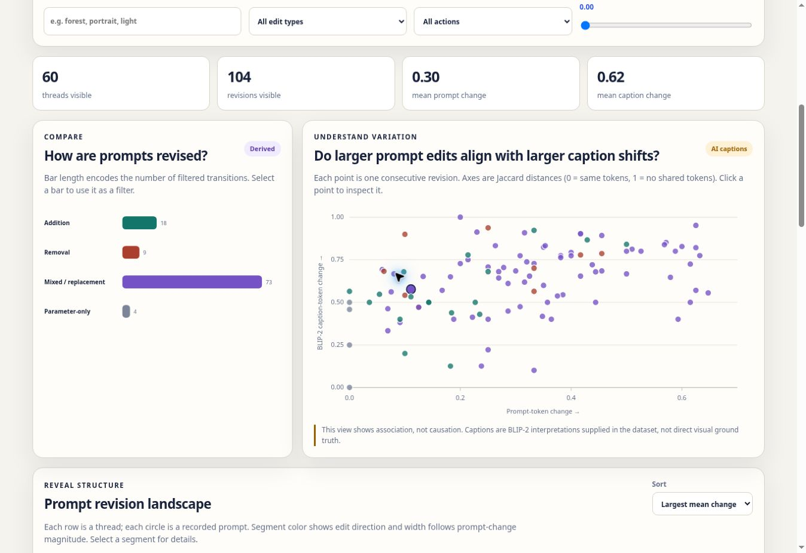

# Prompt Influence Explorer: Exploring Revision Patterns with Transparent Evidence

Sitong Chang · NetID sc972 · Duke Kunshan University

INFOSCI 301: Data Visualization and Information Aesthetics — Autumn 2026

Instructor: Prof. Luyao Zhang

## Abstract

Text-to-image creation involves repeated prompt editing, yet a single before-and-after comparison cannot reveal broader revision patterns or clarify the status of every displayed element. Building on Guo et al.’s PrompTHis [5] and my first provenance-focused redesign, I developed Prompt Influence Explorer. The final prototype analyzes a 20,000-record slice of Midjourney Threads [6], yielding 7,307 qualifying consecutive revisions across 3,116 threads and a browser sample of 60 threads and 104 transitions. Coordinated bars, a prompt-change versus caption-change scatterplot, a revision landscape, a semantic edit matrix, and a details-on-demand inspector support overview and close inspection. Evidence controls separate recorded records, deterministic derivations, BLIP-2 captions, regenerated demonstrations, and unavailable evidence. The contribution is an evidence-aware visual analysis workflow that supports pattern exploration without treating association, model interpretation, or historical action as causal truth.

**Keywords:** provenance; prompt revision; coordinated views; generative AI; responsible visualization

## 1. Introduction and Research Question

PrompTHis visualizes prompt-edit histories through an Image Variant Graph and supports comparison of prompt-image relationships [5]. My first redesign added a provenance-aware inspector for one three-step thread. The final version retains that close-comparison function but addresses a remaining limitation: one example cannot show how revision strategies vary across many threads.

> **RQ: How can interactive visualization help creators explore patterns between prompt revisions and image-description changes while preserving the provenance of recorded, derived, regenerated, and AI-interpreted evidence?**

This extends my earlier course focus on transparency. Week 1 separated source data from designer-produced ranking values, while Week 2 showed that different questions require different visual idioms. The final design therefore links an overview, filters, selection, and details on demand instead of forcing every question into one comparison view.

The prospective audience is DKU students and novice digital creators who iteratively refine generative-image prompts. This remains a scoped audience hypothesis rather than a validated community-wide need. The project connects narrowly to SDG 4.4 through practice in AI and data literacy: users inspect how claims were produced instead of receiving model-generated explanations as neutral facts.

 

**Figure 1. Field evidence and design inspiration.** (a) *Energy Big Data in Shanghai*: dense system overview. (b) *Global Energy Map*: focused geographic comparison. Shanghai Science and Technology Museum, September 4, 2026. These photographs are design inspiration, not evidence about visitor comprehension.

## 2. Critical Evaluation and Governance

### 2.1 Classic four-level validation

**Table 1. Four-level validation of PrompTHis and the current redesign.**

| Level | Evidence and design consequence |
|---|---|
| Domain | PrompTHis targets artists; novice-student provenance comprehension is not its evaluated domain. I therefore retain a scoped student audience. |
| Data/task | The 20,000-record source slice supports pattern exploration, but creator intention and causal prompt effects remain unavailable. |
| Idiom | Bars, a scatterplot, a thread landscape, a semantic matrix, and an inspector answer comparison, variation, structure, and detail questions. |
| Algorithm | The update uses deterministic token differences and Jaccard distances plus a disclosed keyword heuristic. BLIP-2 caption distance remains model-derived. |

### 2.2 Open science and governance

The complementary source is Midjourney Threads [6]. I analyze the 20,000 records in `threads_0.csv`. A reproducible script groups records by thread and timestamp, retains English consecutive revisions with prompt-token Jaccard similarity of at least 0.35, and produces 7,307 qualifying transitions across 3,116 threads. The browser uses a deterministic sample of 60 threads and 104 transitions, including thread 2231 as the close-inspection case.

The source includes prompt text, record identifiers, timestamps, generation parameters, upscale labels, historical image URLs, and four BLIP-2 captions per record. The recorded historical image URLs for thread 2231 returned HTTP 404 on September 13, 2026. Regenerated images are therefore labeled demonstrations rather than presented as originals.

The interface distinguishes:

- **recorded:** prompts, IDs, timestamps, parameters, and upscale actions;
- **derived:** token differences, edit types, Jaccard distances, and keyword-based semantic focus;
- **AI-derived:** BLIP-2 captions contained in the source dataset and caption-change distances;
- **regenerated:** three new comparison images for thread 2231;
- **unavailable:** historical images, creator intention, and explicit preference.

Upscale is a behavioral trace, not a preference or quality score. Caption change compares model-generated descriptions rather than image pixels, and scatterplot associations are not presented as causal effects.

> **Design objective:** connect aggregate revision patterns to exact source records while keeping computation, model interpretation, demonstration material, and missing evidence visible.

## 3. Integrated Redesign and Demo

The final redesign places an exploratory overview before the existing Influence Inspector. The coordinated views answer four distinct questions:

1. edit-direction bars compare how prompts are revised and also act as filters;
2. a scatterplot shows how prompt-token change relates to BLIP-2 caption-token change;
3. a thread landscape reveals revision length, sequence, edit direction, and outlying transitions;
4. a semantic matrix and inspector show which prompt dimensions changed and expose the exact records.

Search, edit type, upscale action, and minimum-change controls update all views. Selecting a bar, point, thread segment, or matrix cell updates the detailed inspector. Evidence-layer controls allow users to hide derived, AI-caption, or regenerated material while recorded records remain visible.

**Figure 2. Final multi-thread Explorer.** Edit-type bars and the prompt-versus-caption change scatterplot summarize 104 revisions across 60 sampled threads and link to source inspection.

Four human decisions define the final redesign:

1. retain Baseline and the inspector so patterns can be checked against exact records;
2. add a view only when it answers a comparison, variation, or structure question;
3. do not encode upscale or distance measures as quality, preference, or causal influence;
4. let users hide interpretive layers while keeping recorded evidence visible.

Static HTML, CSS, JavaScript, and JSON implement the interface; a Python script rebuilds the analysis file.

- Website: https://infovis-sc972.vercel.app/
- Project: https://github.com/dku-infosci301-Autumn2026/infovis-sc972

## 4. Evaluation and Findings

The formative evaluation concerns the first one-thread provenance redesign, not the final Explorer. Four DKU students completed related inspection tasks using the Image Variant Graph and evidence sections; I recorded time, confidence, behavior, comments, and implications.

**Table 2. Descriptive formative-evaluation results.**

| Measure | Observed result | Interpretation |
|---|---|---|
| Completion and time | 4/4; median 82.5 s | 68–112 s; tasks differed |
| Confidence | 3, 4, 4, 3 | Median 3.5/5 |
| Initial ambiguity | 4/4 | Provenance, edge, upscale, or AI authority |
| After cue | 4/4 corrected | Formative; no baseline or final-Explorer test |

P1 confused a regenerated image with historical output; P2 read graph edges as similarity; P3 inferred preference from upscale; and P4 treated AI interpretation as a causal answer. Each revised the interpretation after checking labels, timestamps, prompt changes, or claim limits.

Cues corrected misunderstanding, but often only after it began. The next revision should place provenance beside images, mark **Earlier → Later**, pair **Observed: upscale** with **Unknown: reason or preference**, and visually subordinate AI interpretation.

The findings are descriptive: tasks differed, the sample is small, and there is no controlled baseline. The final Explorer remains untested; BLIP-2 caption distance is a model-derived proxy.

## 5. Contribution and Next Step

The final contribution is an evidence-aware workflow that links multi-thread pattern exploration to source-level inspection while preserving provenance.

The prototype does not recover historical images, infer intention or preference, treat captions as visual truth, or establish causal prompt effects.

Next, I would compare the Explorer with the one-thread interface using matched tasks and a larger art, design, and creative-technology sample, while separately checking AI-caption accuracy and neutrality.

## Acknowledgements

I thank the four anonymous student participants and the peer reviewers who motivated this update. The baseline adapts PrompTHis [5], and analysis data come from Midjourney Threads [6]. I verified source records, calculations, visuals, claims, and evaluation summaries; Appendix B gives the full AI disclosure.

## References

[1] Tamara Munzner. 2009. “A Nested Model for Visualization Design and Validation.” *IEEE Transactions on Visualization and Computer Graphics* 15(6), 921–928. https://www.cs.ubc.ca/labs/imager/tr/2009/NestedModel/

[2] Mark D. Wilkinson et al. 2016. “The FAIR Guiding Principles for Scientific Data Management and Stewardship.” *Scientific Data* 3, 160018. https://doi.org/10.1038/sdata.2016.18

[3] Timnit Gebru et al. 2021. “Datasheets for Datasets.” *Communications of the ACM* 64(12), 86–92. https://doi.org/10.1145/3458723

[4] R. Ziman, S. Saharan, G. McGill, and L. Garrison. 2026. “‘It Looks Sexy but It’s Wrong’: Tensions in Creativity and Accuracy Using GenAI for Biomedical Visualization.” *IEEE Transactions on Visualization and Computer Graphics* 32(1), 320–330. https://doi.org/10.1109/TVCG.2025.3633883

[5] Y. Guo, H. Shao, C. Liu, K. Xu, and X. Yuan. 2024. “PrompTHis: Visualizing the Process and Influence of Prompt Editing during Text-to-Image Creation.” *IEEE Transactions on Visualization and Computer Graphics*. https://arxiv.org/abs/2403.09615

[6] S. Don-Yehiya, L. Choshen, and O. Abend. 2023. “Human Learning by Model Feedback: The Dynamics of Iterative Prompting with Midjourney.” *Proceedings of EMNLP 2023*. https://aclanthology.org/2023.emnlp-main.253/

[7] Shachar Don-Yehiya et al. *Mid-Journey-to-alignment*. https://github.com/shachardon/Mid-Journey-to-alignment

[8] United Nations Department of Economic and Social Affairs. “Goal 4: Quality Education — Target 4.4.” https://sdgs.un.org/goals/goal4

[9] Lee et al. 2024. “Diffusion Explainer.” IEEE VIS 2024 short paper and interactive system. https://ieeevis.org/year/2024/program/paper_v-short-1224.html
