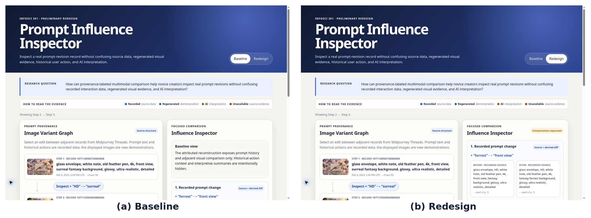

# Prompt Influence Inspector: Separating Recorded Evidence from AI Interpretation

Sitong Chang · INFOSCI 301 · Two-Page Main Paper

## Abstract

Text-to-image creation often involves iterative prompt editing, but visible output differences do not reveal which information is historical evidence, regenerated demonstration, or AI interpretation. Building on PrompTHis [1], I redesign its prompt-history comparison for provenance-aware inspection. The prototype combines a real three-step sequence from Midjourney Threads [2] with regenerated images and a multimodal visual-change summary. The resulting Influence Inspector separates recorded prompts and upscale actions, derived word differences, regenerated media, unavailable historical images, and AI interpretation. A formative evaluation with four DKU student proxies found clearer provenance understanding and more complete prompt-edit identification in the redesign, while also revealing continuing uncertainty caused by generation variability. The contribution is a provenance-layered comparison pattern for critical inspection of generative-AI histories.

## 1. Research Question and Design Context

PrompTHis represents text-to-image creation history through an Image Variant Graph in which generated images form nodes and prompt changes form edges [1]. It already supports prompt comparison and influence analysis, so my redesign does not claim to invent these capabilities. Instead, I ask:

> **RQ: How can provenance-labeled multimodal comparison help novice creators inspect real prompt revisions without confusing recorded interaction data, regenerated visual evidence, and AI interpretation?**

The project extends an earlier course concern with transparency: system-generated rankings, derived values, and AI explanations should not appear as neutral source facts. Field observations at the Shanghai Science and Technology Museum reinforced a related visualization lesson: a dense overview and a focused comparison foreground different questions. This motivated retaining the graph for revision history while adding a focused inspector for evidence comparison.

The prospective audience is DKU students and novice digital creators using generative AI for coursework or creative experimentation. This is a scoped proxy audience rather than a claim about professional artists.

## 2. Critical Evaluation and Data Governance

Table 1 applies Munzner’s nested model [3] to identify what should be retained and what requires redesign.

**Table 1. Four-level validation and redesign consequence.**

| Level | Evidence-based boundary | Redesign consequence |
|---|---|---|
| **Domain** | PrompTHis was designed around artists; novice-student provenance comprehension was not its evaluated domain. | Test comprehension with student proxies rather than claim professional workflow improvement. |
| **Data/task** | Prompt histories support review and comparison, but creator intention and explicit preference are not directly available. | Use a real revision thread but do not infer intention or preference. |
| **Idiom** | The graph reveals history, but dense nodes and edges can distract from focused comparison [1]. | Retain the graph and add a side-by-side Influence Inspector. |
| **Algorithm** | PrompTHis documents embedding, alignment, clustering, and influence computation, but these depend on model and layout choices [1]. | Do not reproduce or claim its influence scores; use an inspectable static artifact. |

The complementary data source is **Midjourney Threads** [2]. I use three consecutive records from `thread_id = 2231`, producing two compact revisions: adding “HD” while removing “surreal,” and adding “forrest” while removing “front view.”

The historical image URLs for all three selected records returned HTTP 404 on September 13, 2026. Replacing them silently would create **evidence substitution**. The interface therefore distinguishes five provenance classes:

- **recorded:** prompts, parameters, IDs, timestamps, upscale Boolean;
- **derived:** word-level additions and removals;
- **regenerated:** newly generated comparison images;
- **interpreted:** AI-produced visual tags and summaries;
- **missing:** historical images, creator intention, and explicit preference.

The upscale label is treated only as a historical behavioral trace. It is not encoded as preference, quality, or ranking.

> **Design objective:** help users identify a recorded prompt edit while distinguishing source evidence, derived information, regenerated media, missing evidence, behavioral traces, and AI interpretation.

## 3. Integrated Redesign

The redesign adds an **Influence Inspector** coordinated with the existing graph. Selecting an edit edge reveals:

1. recorded before/after prompts and an explicit word diff;
2. regenerated images with a missing-source warning;
3. the later record’s historical upscale action;
4. a labeled AI-generated visual summary.

A persistent legend separates recorded, regenerated, interpreted, and unavailable information.

**Figure 1. Baseline versus Redesign.** The Baseline retains a simplified PrompTHis-style history graph. The Redesign adds provenance labels, explicit prompt differences, historical-action context, and AI interpretation while keeping unavailable evidence visible.

Three human decisions define the redesign. First, the graph is retained because it still communicates revision sequence. Second, upscale is not converted into a score or visual ranking. Third, evidence and interpretation are separated instead of being merged into one seamless explanation.

The generated images and AI summaries are stored locally rather than produced through a live API. This improves reproducibility and deployment reliability but does not eliminate model error or generation randomness.

## 4. Formative Evaluation

Four DKU student proxies completed one Baseline task and one Redesign task in counterbalanced order. They identified prompt edits, explained visible changes, classified provenance, interpreted upscale, and rated confidence from 1–5.

The study was formative rather than controlled: participants did not always inspect identical edit pairs across conditions, so results are descriptive rather than causal.

**Table 2. Formative evaluation results.**

| Measure | Baseline | Redesign |
|---|---:|---:|
| Fully correct prompt-edit identification | 2/4 | 4/4 |
| Fully correct provenance distinction | 0/4 | 4/4 |
| Median completion time | 87.5 s | 66.5 s |
| Median confidence | 3.5/5 | 4.5/5 |
| Correct upscale interpretation | — | 4/4 |

The strongest pattern concerned provenance. In Baseline, participants either mistook regenerated images for historical source material or remained uncertain about their status. In Redesign, all four correctly distinguished recorded data, regenerated demonstrations, and AI interpretation.

The explicit word diff also appeared to help with missed removals: two Baseline participants initially overlooked deleted terms, while all four identified complete edits in Redesign.

All four participants correctly rejected the claim that upscale represented objective preference or image quality.

However, generation variability remained visible. Participants noticed changes in composition, position, and layout that could not safely be attributed to one prompt edit. This supports keeping uncertainty visible and avoiding statements such as “this word caused this image change.”

## 5. Contribution and Limitations

The project contributes a **provenance-layered comparison pattern** for generative-AI visualization. Instead of presenting source records, regenerated media, behavioral traces, missing evidence, and AI explanations as one authoritative account, the redesign makes their evidentiary roles inspectable.

The prototype cannot recover the original Midjourney images, determine creator intention, prove causal prompt effects, or convert upscale into preference. It uses one three-step thread and only four student proxies, so the evaluation does not establish general effectiveness.

The next iteration should strengthen regenerated-image labels, shorten explanatory text, and test the provenance pattern with a larger and more diverse group of art, design, and creative-technology users.

## References

[1] Y. Guo, H. Shao, C. Liu, K. Xu, and X. Yuan. “PrompTHis: Visualizing the Process and Influence of Prompt Editing during Text-to-Image Creation.” *IEEE Transactions on Visualization and Computer Graphics*, 2024.

[2] S. Don-Yehiya, L. Choshen, and O. Abend. “Human Learning by Model Feedback: The Dynamics of Iterative Prompting with Midjourney.” *Proceedings of EMNLP*, 2023.

[3] T. Munzner. *Visualization Analysis and Design*. CRC Press, 2014.

[4] M. D. Wilkinson et al. “The FAIR Guiding Principles for Scientific Data Management and Stewardship.” *Scientific Data*, 2016.

[5] T. Gebru et al. “Datasheets for Datasets.” *Communications of the ACM*, 2021.

Full technical evidence, field observations, data-governance details, participant records, and continuity with earlier course work appear in Appendix A. AI assistance and human verification are documented in Appendix B.
